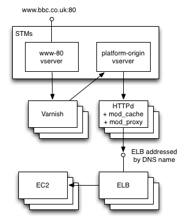

# Introduction

The paper to be evaluated is 'Web Application Firewalls: Enterprise Techniques' by Jason Pubal [-@pubal], as published on the SANS Institute Reading Room.

# Executive Summary of Paper

The domain of the paper is the use of Web Application Firewalls (WAFs) to monitor web application traffic for the purpose of detecting or preventing malicious activity. WAFs are a relatively new category [@nist800-41] of security product specifically designed to apply various rule sets to HTTP/HTTPS traffic, including those designed to prevent common web application vulnerabilities such as SQL injection or cross-site scripting (XSS) [@conklin].

The paper reports an increase in the prevalence of web applications and attacks against them, and says that organisations can manage risks around Internet-facing web applications by using a WAF both to block malicious traffic and perform 'virtual patching' when a new vulnerability is discovered. The author contrasts WAFs with 'traditional' network intrusion and prevention systems (IDS/IPS), which he says are less able to prevent such attacks. WAFs work by inspecting HTTP requests and responses and comparing them to attack 'signatures', either blocking such attacks or raising alerts. He describes 'positive' and 'negative' security models, analogous to the possible _default policy_ of a packet filtering firewall described by Stallings and Brown [-@stallings]. The author suggests that negative security models are easier to set up and have a lower maintenance burden than those using positive models, but may offer lower protection.

Various approaches to deploying a WAF in a network environment are described. In a 'Reverse Proxy' configuration the WAF sits inline between a web server and the network's external firewall (what Scarfone and Hoffman [-@nist800-41] call the _ingress point_), proxying inbound requests to the server, while a 'Layer 2 Bridge' WAF is also inline but operates at a lower network layer, blocking traffic as required by simply dropping packets. An 'Out-of-Band' WAF is not inline but receives a copy of network traffic which it monitors passively, interrupting malicious connections where possible. The 'Server Resident' configuration means that WAF software is installed on the web server itself, while 'Internet Hosted/Cloud' deployments rely on software as a service (SaaS) from a third-party cloud provider, with the WAF conceptually inline.

In the next section the author covers the main motivations behind the use of WAFs in organisations. The benefit given for 'production' applications, even those developed using a secure software development lifecycle (SDLC) is that the cost of rectifying security issues in live production applications is reduced. This is shown as particularly relevant to legacy applications developed in house and commercial off-the-shelf (COTS) software, where the organisation's ability to fix underlying code may be restricted due to loss of development skills or lack of vendor cooperation. The author situates this approach as part of a vulnerability management process, specifically the need to 'shield' a vulnerable application from attacks while the affected code is fixed or updated. The accuracy of a WAF is said to increase if it can import results from a dynamic application security testing (DAST) tool.

Another motivation given for WAF adoption is compliance, such as with the Payment Card Industry Data Security Standard [-@pcidss] for handling payment card information. This standard's requirement to review web applications using vulnerability assessment tools after any changes, and the high fines for which organisations are liable, make WAFs an attractive alternative route to compliance. Next the paper describes the role of WAFs as sensors within a larger intrusion detection system (IDS). Data from a WAF can be sent to an organisation's security incident and event management (SIEM) system for correlation with other data, which the author says expands such a system's abilitty to detect attacks on the organisation's web properties. A brief depiction of major WAF vendors at the time of writing is then given.

The rest of the paper describes a lab environment created by the author to demonstrate how a WAF can be used to support virtual patching and security monitoring. Using the 'server-resident' model, the open-source ModSecurity WAF is installed on the same Linux virtual machine as a application designed to exhibit common security vulnerabilities, Damn Vulnerable Web App (DVWA). The OWASP Core Rule Set (CRS) is imported into ModSecurity, while on a separate virtual server the log management tool AuditConsole is installed to illustrate the handling of audit logs. Lastly a Windows host running a DAST tool called Burp Suite is deployed, and another tool, ThreadFix, that aggregates results from various security testing tools including Burp Suite and uses them to generate WAF rules that ModSecurity can import.

The author discusses virtual patching in more detail, illustrating it with the example of a (deliberate) XSS vulnerability in DVWA. DAST tools identify such web vulnerabilities by recursively checking pages in the application. Burp Suite is used to test DVWA and identifies the XSS vulnerability above. The Burp Suite results for DVWA, including the XSS vulnerability, are imported into ThreadFix, which generates ModSecurity rules. After deployment, the XSS vulnerability is manually re-tested and is blocked by the WAF. The author states that it may not always be possible to remediate vulnerabilities entirely using virtual patching and it should be viewed as temporary risk reduction.

The author describes how a Network Security Monitoring (NSM) shifts the goal to detecting and reacting appropriately to (inevitable) security incidents. The phases are broken down into collection, in which sensors (including WAFs) collect data, detection, in which alerts are generated, and analysis, when a human interprets the alerts and takes any action. The author states that the importance of WAF NSM sensors depends on how critical web applications are to the organisation. He demonstrates using ModSecurity as an NSM sensor sending logs and alert data to the AuditConsole management tool.

In conclusion, the author re-emphasises the importance of web applications today and mentions again the particular value of WAFs in shielding vulnerable legacy/COTS web applications. He suggests that WAFs have visibility into application traffic that no other monitoring tool is capable of. Finally, the author points out the specialist skill set required for application security monitoring as opposed to 'general' network monitoring, and recommends that suitable training is provided.

# Organisational impact of topic for BBC News

The first security management question to answer is what the organisation wants to protect [@stallings]. BBC News receives 28m monthly unique visitors in the UK alone [@dcms] and has a 30% share of Britain's market for online news [@guardian], making it a valuable asset.

## Threat characteristics

Several classes of intruder might consider the BBC website an appealing target. Although it does not process financial information, the organisation's current drive to serve more personalised content [@bbc2016] entails gathering more user data, which could attract cyber criminals focused on identity theft. Because of its reputation as a trustworthy news source, BBC News could be targeted by 'hacktivist' groups motivated by a political cause [@stallings]. Most concerning of all is are highly-skilled Advanced Persistent Threats (APTs) backed by foreign governments, which are reported to be increasingly targeting the UK [@independent]. The Verizon 2016 Data Breach Investigations Report [-@dbir], which Pubal also cites, shows that public or government targets were the largest victims of cyber espionage breaches. BBC web intrastructure has suffered numerous distributed denial-of-service (DDoS) attacks over recent years, some of which have caused major outages [@bbc2015a].

Also important is the rise in web applications as an attack vector. The ENISA Threat Landscape report [-@enisa] lists web application attacks as the third-most significant threat, with a 15% yearly increase, while the Verizon report [-@dbir] shows that web application attacks are growing across almost all industries, suggesting one reason for this is that web applications may be the only route in to sensitive data in storage. This indicates that web application attacks are particularly in need of attention.

## Transition to cloud computing and DevOps

Recently the BBC has started migrating some of its online services from a centrally-managed application stack running on colocated server hardware to a heterogenous cloud-based model in which products (such as News) provision their own cloud hosting. This will enable a significant reduction in data centre costs, however the transitional 'hybrid' cloud model results in an increased network attack surface (shown in Figure \ref{cloud}).

{ width=50% }

With the move to the cloud, the development of online services at the BBC is embracing a 'DevOps' philosophy based around continuous delivery [@devops]. Where in the past developers wrote software that was then handed over to a specialised operations team for deployment, these traditional operational siloes are changing, with responsibility for deployments being shared. Developers therefore need understanding of the production environment, including operating system and networks, and therefore of the information security challenges unique to these areas.

## Stakeholder attitudes and responses

In order to conduct an informal risk analysis for BBC News (and recognising the limitations of such an approach) it is useful to identify key stakeholders, that is, groups that may be concerned about or affected by the topic.

**End users** -- UK audiences perceive the BBC website as the most trustworthy, accurate and impartial source of news [@dcms]. Any threat action that compromises the data integrity of BBC News (for example, through deception arising from _falsification_ [@rfc4949] of news reports), will have an impact on public perceptions and therefore support for the BBC. End users also have an expectation of _availability_, i.e. that BBC News services are available when they want them.

**Web application developers** -- These should be aware of the most critical web application weaknesses, such as the OWASP Top 10 [-@owasp], and mitigate them when writing code. Developers are increasingly expected to have a broader range of 'DevOps' skills, but may lack confidence in some areas. They have a unique understanding of application internals and are able to specify, for example, valid input patterns. They may wish to learn more about using WAFs to supplement protections in application code.

**Network administrators** -- They are aware of the security benefits of WAFs over lower-level packet filtering. However they may be concerned about the processing overhead of inspecting higher-level protocols and the potential impact on network throughput [@cheswick]. They may have concerns about adding to an already complex set of controls - i.e. another set of ingress rules to be understood and maintained. They may be particulary interested in using WAFs to perform 'virtual patching' on vulnerable systems.

**Information Security officers** -- As Maiwald and Sieglein [-@maiwald] point out, the role of the Information Security department is not to guarantee security, but to help the organisation manage risks. Given the BBC's constrained level of funding, these staff would want to evaluate the potential opportunities and costs of using WAFs in the context of the organisation's overall risk appetite. They would be involved in issuing any policy or plan around use of WAFs.

_Note_: The BBC is currently regulated by the BBC Trust, which sets high-level policies for the running of the organisation, including the way that 'key operating risks' must be reported [@bbc2015b]. Information security policies need to consider this supervisory framework, corresponding to the _legislation_ policy management layer identified by Hare [-@hare].

**Senior management** -- Managers at the BBC see the benefit of continuous delivery in getting new features into production faster. They are also most aware of the potential consequences of any harm to the BBC's reputation caused by a loss of service availability or data integrity. They are keen to reduce hosting costs by driving cloud migration but do not want to increase the organisation's risk exposure to unacceptable levels. They are likely to have a general understanding of the idea of a 'firewall' but not the specific characteristics or benefits of WAFs.

Table \ref{risk-register} gives an excerpt from a risk register [@stallings] for this context.

------------------------------------------------------------------------------------------
Asset    Threat/            Exiting     Likelihood  Consequence  Level of         Priority
         Vulnerability      Controls                             Risk                        
-------  -----------------  ----------  ----------  -----------  ---------------  --------
News     Content modified   Policies    Possible    Major        High                    1
website  or defaced

News     Site unavailable   Policies,   Possible    Moderate     High                    2
website  or slow            CDNs

------------------------------------------------------------------------------------------

Table: Risk register of WAF-related threats for BBC News\label{risk-register}

# Example security plan

If the BBC wishes to implement a security plan around the above, it should first identify controls that could help to reduce each risk to acceptable levels [@nist800-53]. These controls can be broadly classified as management, operational or technical [@stallings]. Table \ref{risk-controls} shows some examples.

------------------------------------------------------------------------------------------
Control                         Class                   Instance of [@nist800-53]
------------------------------  ----------------------  ----------------------------------
Vulnerability scan cloud        Management              RA-5 Vulnerablilty Scanning
origin servers

Detect and block attacks using  Operational,            SI-3 Malicious Code Protection,
a WAF                           Technical               SC-7 Boundary Protection

Ensure all input validated      Operational             SI-10 Information Input Validation
in application code
------------------------------------------------------------------------------------------

Table: Controls for risk 'Content modified or defaced' \label{risk-controls}

Cost-benefit analysis suggests that implementing a WAF control may reduce the likelihood and severity of web application attacks with relatively low costs. The appropriate security policy layer is 'standard', since it will include "mandatory activities, actions, rules or regulations" [@hare, p 19]. The target audience for the BBC WAF standard will be technical architects, web application developers and network administrators. The likely proponent of the standard would be the BBC information security function [@howard].

An outline WAF standard is given below with some of the key information it should include.

## Purpose

The purpose of this standard is to increase the security of BBC web services hosted in the cloud by requiring all new applications to include a Web Application Firewall (WAF) into their proposed architecture.

## Background

(Refer to threat landscape description in previous section.)

## Scope

This standard applies to all new public cloud-hosted web applications regardless of domain, cloud provider (AWS, Google, etc.) or product (e.g. News, iPlayer). It does not apply to web applications for internal use, or to applications deployed within private cloud platforms, or existing live applications.

## Policy

In addition to complying with existing BBC policies [link] around common web application weaknesses (e.g. OWASP Top 10, CWE/SANS Top 25), it is mandatory for cloud-hosted web applications to be protected against common attacks through the deployment of a WAF or equivalent component.

This standard does not specify the use of a specific WAF product or architecture. However, the following mandatory requirements must be observed:

- The WAF should be 'inline' at all times
- All traffic through the WAF should be logged for auditing purposes
- Products must assess WAF options using the Web Application Firewall Evaluation Criteria 1.0 [@wafec]

## Compliance

The information security department is responsible for ensuring compliance with this standard and may request evidence from product teams that their WAF is in place and operational, and perform periodic vulnerability scans to verify WAF capabilities.

Non-compliance with this standard will be handled through the BBC disciplinary procedure [link].

## Relevant dates

This standard is effective from DD/MM/YYYY. It is due for review after two years, on DD/MM/YYYY.

Other features removed for brevity here but that may be useful in a standard are a glossary, references, a change log [@sanspolicy], and contact details for the author/and or authorising officer [@hare].

# Evaluation of paper

The main strength of the paper is its detailed description of the lab used to demonstrate how a WAF can be deployed within an enterprise and integrate with other tools into a vulnerability scanning and 'virtual patching' workflow. By using the ModSecurity OWASP Core Rule Set (CRS) as initial input, the approach used validates the capabilties of WAFs to detect and mitigate vulnerabilities found in the OWASP Top 10 [-@owasp], which is referenced by standards such as the PCI DSS [-@pcidss] as an example of best practice in vulnerability management. This therefore suggests that WAFs could form part of a 'baseline approach' to implementing generic, industry-standard security controls against common threats [@stallings]. That said, the OWASP Top 10 is currently being revised, having not been updated since 2013, and so the CRS used may need to be updated to reflect any new guidance that emerges.

## Terminology and classification of controls

Pubal states that WAFs can prevent attacks that "network firewalls and intrusion prevention systems cannot" (p.3), but these terms are used flexibly in vendor marketing and there is often overlap betwen the capabilities of each system. WAFs can be seen as a specialised type of application gateway, one of three categories of firewall (along with packet filters and circuit gateways) identified nearly 15 years ago by Cheswick et al. [-@cheswick], but as they point out, the protocol levels analysed by each category is not clear-cut. More recently, Scarfone and Hoffman [-@nist800-41] use a broad application of the term 'firewall' and compare their capabilities by determing which level(s) of the TCP/IP stack the firewall is able to operate on.

Even within the application layer, it may be helpful to distinguish between WAF functionality focused on the HTTP protocol itself and that protecting against weaknesses in web application code. The data sheet for one market-leading WAF [@imperva] shows it "enforces HTTP standards compliance". This is a firewall behaviour termed 'RFC compliance' [@nist800-41] which protects against weaknesses in the protocol implementation (for example, a 'cookie' that does not conform to the standard could be used as an attack against an insecure HTTP parser). By contrast, guidelines such as the OWASP Top 10 normally focus on weaknesses web application that are built on top of HTTP.

Additionally, the 'out-of-band' configuration described in the paper does not strictly fulfil the usual requirement for a firewall that all traffic must past through it [@cheswick].

## Other benefits of WAF controls

Pubal identifies a number of important reasons to consider WAF controls, including detecting and blocking malicious traffic, 'virtual patching' of legacy/COTS software, and their role within a broader network security monitoring infrastructure. However he only briefly mentions their ability to assist with the creation of security audit trails [@rfc4949]. Cheswick et al. [@cheswick] list the ability to log and control all traffic passing through them as a key advantage of the application gateway category of firewall. Scarfone and Hoffman [-@nist800-41] also suggest that application-layer firewalls are able to provide provide user-oriented services such as enforcing authentication or logging events associated with a system user. For example, a suitably-configured WAF could be used to audit failed login attempts for a given user account, which is listed as a security event that should be audited by standards such as X.816 [@x816]. This could be especially useful where a legacy/COTS web application does not provide its own security audit trail. Some high-end commercial WAF products such as BIG-IP [-@f5] even include 'stateful' rules that can automatically detect and block brute-force login attacks by inspecting application traffic, going well beyond the feature set of the example WAF (ModSecurity) discussed in the paper.

The paper focuses on using WAFs for 'shielding' applications in production that have identified weaknesses, without considering the role they have to play in managing web application risk more generally. Implementing multiple, overlapping layers of security is the well-established principle of _defence in depth_, and as [@stallings] point out may address people and operational concerns as well as technology. In the case of the BBC, the need to educate and support web developers in developing more secure applications and for a robust InfoSec review of possible weaknesses does not preclude adding WAFs as a supplementary layer of protection.

Similarly, the inclusion of centralised WAF protection at the edge of the BBC network, through which all traffic would pass (currently under consideration) does not mean that origin servers should not also include WAF components. The use of multiple layers of firewalls is a common way of providing defense-in-depth [@nist800-41], and where different firewall products or configurations are used the software attack surface may be reduced even further. Moreover, the reduced amount of traffic reaching origin servers (due to centralised caching) makes it more practical to apply types of application layer inspection that are more costly in terms of processing time (such as the 'stateful' rules described above) at this level. By contrast the large volume of requests hitting the edge of the network could make such rules cost-prohibitive, application gateways being "poorly suited to high-bandwidth or real-time applications" [@nist800-41, p.2-6].

## Downsides and arguments against WAF usage

From another perspective, WAFs add additional level of complexity to the organisation's infrastructure and increase the maintenance burden on network administrators. As [@nist800-41] point out, having multiple layers of firewalls make debugging problems more difficult, since potentially mutiple sets of logs have to be checked. This problem is made worse in WAFs, since each layer may modify the HTTP messages, and if the WAF is stateful (for example, applies rules based on a sequence of requests) it becomes even more challenging.

There is also the related argument that many of the protections afforded by WAFs (for example, against XSS) are most appropriately enforced in web application code itself, where set of possible valid inputs can be known with certainty and the risk of false positives (where legitimate user behavior is incorrectly identified as malicious) is therefore lowest. At the higher level, the downside of blocking repeated login attempts at the WAF level is that if the WAF is ever bypassed all protection is lost. Protection may also be weakened if a WAF is replaced with an alternate product that employs different heuristics. Web developers typically mitigate such risks using a test-driven development (TDD) approach which makes it easier to spot regressions, but this methodology is not yet widely used for validating WAF behaviour.

Stemming from the above is the human issue that using WAFs could give application developers a false sense of security, believing that they can postpone or limit protections against common weaknesses because a WAF is inline. Again, should the WAF be bypassed by an attacker, or accidentally disabled, this leave the application unprotected.

A third area which presents challenges for WAF adoption at the BBC is the increasing pressure to encrypt all web traffic using SSL/TLS. Google is one of the main advocates for this trend, tracking SSL adoption across top sites [@google]. By definition WAFs must be able to decrypt such connections in order to inspect the contents, which means that web server SSL certificate(s) must be installed on the WAF system (known as SSL 'offloading'), increasing the complexity of managing certificates across the organisation and enouraging vendor lock-in due to the different approaches handling HTTPS between WAF implementations. Pubal only mentions HTTPS decryption to say that WAFs are more likely to do this than an IPS.

## Implications for cyber security and scope for future work

In the time since the paper was written, organisations such as the BBC have accelerated their transition to cloud hosting. In late 2015 Amazon Web Services (AWS) launched their own Web Application Firewall product [@aws] which has lowered the barriers to adoption through a simple setup process and a pay-as-you-go pricing model (per-rule and per-request). Pubal does refer to a cloud software-as-a-service (SaaS) deployment option for WAFs but does not evaluate any of them in detail. This is a growth area and would a good topic for further investigation.

The concepts of configuration management and infrastructure automation applied to cloud computing have recently come to be closely associated with DevOps [@devops]. Most cloud providers allow architects and developers to define their infrastructure requirements as code, which can be managed and audited through a version control system (VCS). The ability to define WAF rulesets as part of this infrastructure creates an opportunity for web application code to be packaged along with a firewall ruleset tailored to the application by its developers, for automated deployment. This could also be a fruitful area for further research.

# Conclusion

# References
